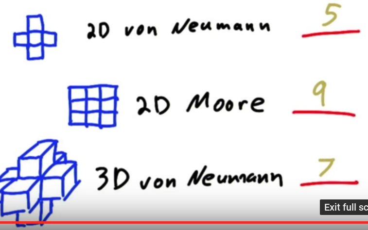

#GPU Hardware and Parallel Communication patterns

Parallel computing means many threads solving a problem by working together. Working together involves communication between threads. CUDA performs this communication using memory.
Threads may be need to read from same input location, threads may need to write to same location sometimes thread may need to share partial data.

##Parallel Communication Patterns

Its really about how to map tasks and memory together.
Each task is going to readfrom and write to a specific place in memory there is one to one correspondance between input and output

Gather function
-------
This function gathers input data elements from different places and to compute an output result. 
eg - Mean or average, for blurring image etc

Scatter function
-------
Several threads writing to same place. 
eg - Take one pixel value increment it and write to nearby pixel values.

Stencil
-------
Tasks read input from a fixed neighbourhood in an array. Data resuse happens oftens. 2D Von Neumann stencil, 2D Moore Stencil, 3D Von Neumann stencil are examples.

How many times a given input value be read  when applying each stencil?
- 2D Von Neumann stencil - 5
- 2D Moore Stencil - 9
- 3D Von Neumann - 7
{ width=40% }