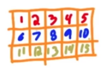
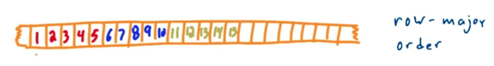
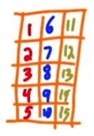

#GPU Hardware and Parallel Communication patterns

Parallel computing means many threads solving a problem by working together. Working together involves communication between threads. CUDA performs this communication using memory.
Threads may be need to read from same input location, threads may need to write to same location sometimes thread may need to share partial data.

##Parallel Communication Patterns

Its really about how to map tasks and memory together.
Each task is going to readfrom and write to a specific place in memory there is one to one correspondance between input and output

Gather function
-------
This function gathers input data elements from different places and to compute an output result. 
eg - Mean or average, for blurring image etc

Scatter function
-------
Several threads writing to same place. 
eg - Take one pixel value increment it and write to nearby pixel values.

Stencil
-------
Tasks read input from a fixed neighbourhood in an array. Data resuse happens oftens. 2D Von Neumann stencil, 2D Moore Stencil, 3D Von Neumann stencil are examples.

How many times a given input value be read  when applying each stencil?
- 2D Von Neumann stencil - 5
- 2D Moore Stencil - 9
- 3D Von Neumann - 7
{ width=40% }

Transpose
--------------

Suppose you have a 2D image

{ width=30% }

It is laid out in a row major order. This means that the elements of the array or the pixels of the image is laid out one row at a time.

{ width=90% }

But if you want to do some operations column wise like this

{ width=20% }

For this we need to do an operation to reorder the elements like scatter operation. Each thread is reading from adjacent element in array but writing to some place scatterd in memeory according to row column transpose 2D iamge.

{ width=90% }

Transpose opeartions comes when we are doing array,matrix or image operations.The concept is applicable to generally all kind of data structures.

An example

```c
	struct foo{
		float f;
		int i;
	};
```

so how an array of structures will look in this memory

```c
	foo array[1000];
```
{ width=90% }

So if we are accessing all of the floats to do some operation then it is efficient to get them all continously.
{ width=90% }

Array Of Structures - AOS
Structure Of Arrays - SOA

So transpose operation tasks reorder data elements memory.

Quiz  - Label code snipets by pattern
--------------
```c
	float out[],in[];
	int i = threadIdx.x;
	int j = threadIdx.y;
	
	const float pi = 3.1415;
	
	out[i] = pi * in[i];
	out[i + j*128] = in[j + i*128];
	
	if(i%2){
		out[i-1] += pi*in[i]; out[i+1] += pi*in[i];
		out[i] = (in[i] + in[i+1] + in[i-1]) * pi/3.0f;
	
	}
```